# Seat Defect Inspection 图像主流程细节说明

本文聚焦当前项目里“输入图像进入主流程后，分别被哪些模块处理、处理成什么样、在哪一步被判为 OK / NG / REJECT”。

这里说的“生图”，统一指相机或离线文件刚进入系统时的原始图像。本文覆盖 3 条与图像最相关的链路：

1. `inspect` 在线检测
2. `inspect-folder` 离线批量检测
3. `train-patchcore` 正常样本训练

这 3 条链路共享同一套单机位图像准备流程：`_CameraPipeline.prepare_image(...)`。

---

## 1. 一张图进入系统后的总流程

```mermaid
flowchart LR
    A["原始图像 / 相机帧"] --> B["AcquisitionService<br/>采集并标准化成 FramePacket"]
    B --> C["PreprocessEngine<br/>畸变校正、缩放、去噪、白平衡、光照归一、CLAHE、锐化"]
    C --> D["DetectionService<br/>YOLO 分割检测 / fallback_box"]
    D --> E["RoiRefineEngine<br/>裁切 ROI、生成 target_mask / valid_mask、缩放对齐"]
    E --> F["ImageQualityGuard<br/>只在 valid_mask 前景内做质量门控"]
    F -->|通过| G["PatchCore 输入选择<br/>优先 texture_ready_image"]
    F -->|不通过| R1["REJECT"]
    G --> H["PatchCore<br/>纹理异常检测 + 热力图 + patch 证据"]
    H -->|有效 patch 太少| R2["REJECT"]
    H --> I["ColorConsistencyService<br/>可选颜色一致性分支"]
    I --> J["单机位结果<br/>OK / NG / REJECT"]
    J --> K["fusion.py<br/>多机位融合"]
    K --> L["reporting.py<br/>输出 JSON 报告"]
    J --> M["cvops.debug_artifacts<br/>输出调试图"]
```




---

## 2. 各模块对图像分别做了什么

### 2.1 图像采集：把不同来源统一成 `FramePacket`

实现位置：

- `src/seat_defect_inspection/acquisition.py`
- `src/media_inputs/`
- `src/mvsCamera/`

处理内容：

- 根据 `source` 自动识别输入类型，支持图片、视频、普通相机、MVS 相机。
- 在线 `inspect` 会先并发采集全部启用机位，形成一个按机位配置顺序排列的采图结果列表，再进入后续算法流程。
- 如果输入本身就是图片文件，直接读入。
- 如果输入是流式设备，会按 `capture_retries` 重试抓帧。
- 产出统一结构 `FramePacket`，里面带有：
  - `camera_id`
  - `frame_id`
  - `part_id`
  - `timestamp`
  - `source`
  - `source_kind`
  - `image`

这一阶段对图像本身几乎不做视觉增强，重点是“把输入源统一成后续流程能消费的 BGR 图像”。

---

### 2.2 预处理：把原始图变成更稳定的检测输入

实现位置：

- `src/seat_defect_inspection/preprocess/engine.py`

执行顺序：

1. 复制输入图像，避免原图被原地改写。
2. 如果配置了相机内参与畸变参数，先做 `cv2.undistort(...)` 去畸变。
3. 如果配置了 `resize_width / resize_height`，先统一尺寸。
4. 去噪。
5. 白平衡。
6. 光照归一化。
7. 可选锐化。

具体处理细节：


| 处理项    | 实际做法                                                        |
| ------ | ----------------------------------------------------------- |
| 畸变校正   | 只有在同时配置 `camera_matrix` 和 `distortion_coeffs` 时才启用          |
| Resize | 用 `cv2.INTER_AREA` 缩放到固定尺寸                                  |
| 去噪     | 支持 `none`、`bilateral`、默认高斯模糊                                |
| 白平衡    | 支持 `gray_world`；按三通道均值自动估计增益，并用 `max_white_balance_gain` 限幅 |
| 光照校正   | 先转 LAB，只处理 `L` 通道；可通过大核高斯模糊估计背景光照，再做亮度拉平                    |
| CLAHE  | 仍然只作用于 `L` 通道，增强局部对比度                                       |
| Gamma  | 可选查表变换                                                      |
| 锐化     | 可选 `unsharp mask`                                           |


当前示例配置 `configs/seat_defect_inspection.mvs.json` 中，5 路相机都基本采用：

- `denoise_method = gaussian`  降噪模式
- `gaussian_kernel_size = 5`   核大小 5 x 5
- `white_balance_method = gray_world`  白平衡
- `max_white_balance_gain = 1.2`
- `apply_illumination_correction = true`
- `illumination_blur_kernel_size = 51`
- `illumination_strength = 0.65`
- `apply_clahe = true`
- `clahe_clip_limit = 2.0`
- `clahe_tile_grid_size = 8`
- `sharpen = false`

这一阶段的输出是 `preprocessed_image`。YOLO、ROI 裁切、训练流程后续都使用这张预处理后的图，而不是原图。

---

### 2.3 YOLO 检测：找到座椅主体和需要忽略的干扰区域

实现位置：

- `src/seat_defect_inspection/yolo/detection.py`

处理内容：

- 如果配置了 `model_path`，用 Ultralytics YOLO 做推理。
- 只接受 segmentation 权重，不接受普通 detect 权重。
- 从所有检测框中：
  - 取 `target_class` 里置信度最高的一个作为主目标 `target`
  - 其余检测结果只保留在 `all_objects` 里用于调试观察，不再参与 ROI 忽略物管理
- 如果没有 `model_path`，就退化成 `fallback_box` 静态框模式。

当前示例配置中：

- `target_class = seat`
- `confidence = 0.5`
- `iou = 0.45`

YOLO 对图像做的事情本质上不是增强，而是“定位”：

- 座椅主体在哪

如果这一阶段没有找到主目标：

- 直接返回 `target_not_found`
- 单机位结果会被标记为 `REJECT`

---

### 2.4 ROI 精修：把整图缩成真正要做异常检测的区域

实现位置：

- `src/seat_defect_inspection/cvops/roi.py`
- `src/seat_defect_inspection/cvops/roi_geometry.py`

这一步是整条链路里对图像“重塑”最明显的阶段。

处理顺序：

1. 确定裁切基准框。
2. 扩框或缩框。
3. 从预处理图上裁出 ROI。
4. 构造前景掩码 `target_mask`。
5. 把 ROI 和 `target_mask` 一起缩放到统一输出尺寸。
6. 构造真正参与异常检测的 `valid_mask`。
7. 生成给 PatchCore 用的 `texture_ready_image`。

具体细节如下。

#### 2.4.1 裁切框怎么来

- 优先使用目标分割 mask 的外接框。
- 如果没有 segmentation mask，退回到目标检测框。
- 然后根据配置做轻量扩缩：
  - `crop_expand_ratio`
  - `crop_shrink_ratio`

当前示例配置：

- `crop_expand_ratio = 0.02`
- `crop_shrink_ratio = 0.0`

也就是说，当前工程会在目标区域外面再留一点安全边界，避免裁得过紧。

#### 2.4.2 `target_mask` 怎么来

- 如果 YOLO 返回了分割 mask，就把 mask 裁到 ROI 内作为前景区域。
- 如果没有分割 mask，就直接把整个 ROI 视为前景，全 1。

#### 2.4.3 统一尺寸（当前实现不是几何配准）

- 虽然字段名叫 `aligned_roi_image`，配置项也叫 `alignment`，但当前实现并没有做旋转矫正、透视矫正、ECC 配准或模板配准。
- 当前代码实际做的是把 ROI 图像和 `target_mask` 一起 `resize` 到固定尺寸。
- 图像用 `INTER_AREA`
- mask 用 `INTER_NEAREST`

当前示例配置中，5 路相机都对齐到：

- `output_width = 320`
- `output_height = 320`

这一步的主要目的，是把不同机位、不同工件在裁切后的 ROI 统一到稳定尺寸，方便后续：

- 质量门控按统一口径统计
- PatchCore 使用稳定的 patch 网格
- 调试图和人工复核更容易横向比较

因此这里的“对齐”更准确地说是“裁切后统一尺寸”，不是复杂的几何对齐。

#### 2.4.4 `valid_mask` 怎么来

核心公式：

```text
valid_mask = target_mask > 0
```

然后还会额外做边缘屏蔽：

- `edge_ignore_pixels > 0` 时，ROI 四周固定宽度的边缘直接清零

当前示例配置：

- `edge_ignore_pixels = 4`

如果这样算完后 `valid_mask` 为空，代码会降级兜底：

- 如果 `target_mask` 还有内容，就退回到纯 `target_mask`
- 如果连 `target_mask` 都没有，就退回全 1

#### 2.4.5 `texture_ready_image` 是什么

代码会把 `aligned_roi_image` 转成 BGRA 图像，并把 `target_mask` 写入 alpha 通道，得到：

- `texture_ready_image`

这一步非常关键，因为它等于告诉 PatchCore：

- 只看有效前景
- 背景以透明区域进入，而不是黑色纹理
- CNN 特征提取前会按 alpha / mask 做归一化，避免黑底被学成正常特征
- 被忽略物和无效区域继续由 `valid_mask / ignore_mask` 控制 patch 筛选

---

### 2.5 质量门控：只在有效前景里判定“这张 ROI 能不能看”

实现位置：

- `src/seat_defect_inspection/cvops/quality.py`

质量检测不是在整张原图上做，而是在：

- `aligned_roi_image`
- 配合 `valid_mask`

也就是只统计“真正需要看的座椅前景区域”。

计算指标：

- `laplacian_variance`
- `brightness_mean`
- `overexposed_ratio`
- `underexposed_ratio`
- `is_black_frame`
- `is_white_frame`

判定逻辑：

- 纯黑帧，拒绝
- 纯白帧，拒绝
- 清晰度太低，拒绝
- 平均亮度太低，拒绝
- 平均亮度太高，拒绝
- 过曝像素占比太高，拒绝
- 欠曝像素占比太高，拒绝

当前示例阈值：

- `min_laplacian_variance = 80.0`
- `min_brightness_mean = 30.0`
- `max_brightness_mean = 225.0`
- `max_overexposed_ratio = 0.25`
- `max_underexposed_ratio = 0.35`

如果质量不通过，单机位直接：

- `status = REJECT`
- `reason = quality_xxx`

例如：

- `quality_blur`
- `quality_underexposed`
- `quality_overexposed_ratio`

---

### 2.6 PatchCore 输入选择：到底拿哪张 ROI 去做纹理异常检测

实现位置：

- `src/seat_defect_inspection/util.py`

规则非常简单：

```python
roi.texture_ready_image if roi.texture_ready_image is not None else roi.aligned_roi_image
```

也就是说：

- 优先使用透明背景 BGRA 的 `texture_ready_image`
- 没有的话才用原始对齐 ROI

这保证了训练和推理尽量看的是同一种图像分布。

---

### 2.7 PatchCore：把 ROI 转成 patch 特征，再判断是否异常

实现位置：

- `src/seat_defect_inspection/patchcore/engine.py`
- `src/seat_defect_inspection/patchcore/features.py`
- `src/seat_defect_inspection/patchcore/scoring.py`

当前示例配置使用：

- `backend = full`
- `backbone_name = wide_resnet50_2`
- `feature_layers = layer2 / layer3`

也就是当前项目使用完整 CNN 深特征版 PatchCore。运行配置层已经禁止 `handcrafted` 后端；如果发现旧模型包记录为 `handcrafted`，线上加载会报错并要求重新训练。

#### 2.7.1 进入 PatchCore 前，图像还会再做什么

- 先把 PatchCore 输入图缩放到 `patchcore.image_size`
- 当前示例为 `320 x 320`

补充说明：

- ROI 精修阶段已经把 `aligned_roi_image` 统一到了 `320 x 320`
- 当前示例配置里，`roi.alignment.output_width / output_height` 与 `patchcore.image_size` 恰好相同，都是 `320`
- 所以在当前配置下，PatchCore 前这一步通常不会再发生新的尺度变化
- 如果未来这两组配置不一致，PatchCore 会以 `patchcore.image_size` 为准再做一次 `resize`

PatchCore 特征提取前会先把 BGRA / alpha 输入归一化为 CNN 可消费的 3 通道 BGR/RGB 图像。透明区域不会以黑色像素参与特征表达；如果需要填充，会使用有效前景的统计颜色作为背景占位。

`texture_input` 仍保留在配置中，主要用于历史 handcrafted 特征路径和颜色不敏感模式下的亮度口径约束；当前 full 后端的主要特征来自 CNN backbone。

当前示例配置：

- `texture_input = lab_l`

另外，当前工程 5 路相机都启用了：

- `color_insensitive_mode = true`

这会在模型构建时把辅助纹理口径收敛到亮度主导模式，并默认跳过颜色分支，避免颜色抖动放大。

#### 2.7.2 patch 是怎么筛选的

图像会按滑窗切成 patch：

- `patch_size = 16`
- `stride = 8`

每个 patch 不会全部保留，而是要先过前景有效性筛选：

- patch 内有效前景覆盖率必须 >= `min_target_coverage`

当前示例配置：

- `min_target_coverage = 0.5`

只有通过这个条件的 patch，才会进入 memory bank 比较。

#### 2.7.3 full 后端实际提取了什么

对每个有效 patch，full 后端会走 CNN backbone：

- 先把 PatchCore 输入转为 3 通道图像并按 ImageNet 均值方差归一化。
- 通过 `wide_resnet50_2` 提取中间层特征。
- 默认读取 `layer2 / layer3`，把不同尺度的特征对齐。
- 对每个滑窗 patch 聚合深度特征，形成 embedding。
- 只保留满足 `target_mask / ignore_mask` 筛选条件的 patch embedding。

这些 CNN embedding 会进入后续 memory bank、coreset 和最近邻距离计算。历史 handcrafted 统计特征路径仍保留在代码中用于兼容旧包排查，但当前运行配置不会启用。

#### 2.7.4 分数怎么来的

训练时：

- 用正常样本的 patch embedding 建 memory bank
- 用 coreset 做子采样，压缩内存规模

推理时：

- 计算每个 patch 到 memory bank 的最近距离
- 用 patch 分数的 99 分位作为图像分数 `score`

同时会生成：

- patch 级热力图 `heatmap`
- patch 级证据统计

#### 2.7.5 为什么还有 `valid_patch_ratio`

即使 ROI 存在，也可能因为：

- 前景太少
- ignore 太多
- patch 条件过严

导致真正有效的 patch 很少。

代码会计算：

```text
valid_patch_ratio = valid_patch_count / total_patch_count
```

当前示例配置要求：

- `min_valid_patch_ratio = 0.3`

如果低于这个值，单机位直接：

- `status = REJECT`
- `reason = low_valid_patch_ratio`

#### 2.7.6 异常是怎么判出来的

PatchCore 最终不是只看一个 `score > threshold`，而是综合多组证据：

1. 常规规则
2. critical 小缺陷快速规则
3. peak 高峰值快速规则

常规规则会同时看：

- `score`
- `strong_patch_count`
- `largest_component_patch_count`
- `strong_patch_ratio`
- `largest_component_patch_ratio`

也就是说，当前工程不是“只要有高分就报警”，而是更偏工业判定风格：

- 要看异常分数
- 也要看异常 patch 的数量和连通性

当前示例里，相关配置包括：

- `decision_score_margin = 0.9`
- `strong_patch_score_ratio = 0.8`
- `min_strong_patch_count = 2`
- `min_strong_component_count = 1`
- `min_strong_patch_ratio = 0.005`
- `min_strong_component_ratio = 0.003`
- `critical_score_margin = 0.8`
- `critical_peak_score_margin = 0.9`
- `critical_min_component_patch_count = 1`

最终 `TextureAnomalyResult` 会输出：

- `score`
- `threshold`
- `decision_threshold`
- `is_anomaly`
- `valid_patch_ratio`
- `peak_patch_score`
- `strong_patch_count`
- `largest_component_patch_count`
- `decision_mode`
- `heatmap`

---

### 2.8 颜色分支：可选的颜色一致性判断

实现位置：

- `src/seat_defect_inspection/patchcore/color_branch.py`

只有满足下面 3 个条件时才会执行：

- `camera.color_branch.enabled = true`
- `color_insensitive_mode = false`
- 模型包里存在 `color_profile`

输入：

- `aligned_roi_image`
- `valid_mask`

处理方式：

- 先转 LAB
- 只在 `valid_mask` 覆盖区域内取像素
- 提取 6 维颜色统计：
  - `mean_l`
  - `mean_a`
  - `mean_b`
  - `std_l`
  - `std_a`
  - `std_b`
- 计算该特征到正常颜色分布的标准化距离

当前示例配置里颜色分支是关闭的：

- `enabled = false`
- 同时 5 路相机也都开了 `color_insensitive_mode = true`

因此当前主流程实际运行时，颜色分支默认不会参与最终判定。

---

### 2.9 单机位最终判定：怎么从中间结果变成 OK / NG / REJECT

实现位置：

- `src/seat_defect_inspection/service/inspection_camera.py`

判定顺序：

1. 预处理 / 检测 / ROI / 质量门控失败
  - `REJECT`
2. PatchCore 有效 patch 比例太低
  - `REJECT`
3. 纹理异常且颜色异常
  - `NG`
  - `reason = texture_and_color_anomaly`
4. 只有纹理异常
  - `NG`
  - `reason = texture_anomaly`
5. 只有颜色异常
  - `NG`
  - `reason = color_anomaly`
6. 都没有异常
  - `OK`
  - `reason = all_checks_passed`

可以把这一步理解成：

- `REJECT` 是“图像条件或流程条件不满足，没法可靠判”
- `NG` 是“有明确缺陷证据”
- `OK` 是“流程跑通且没有异常证据”

---

### 2.10 多机位融合：多张图怎么合成最终结论

实现位置：

- `src/seat_defect_inspection/fusion.py`
- `src/seat_defect_inspection/service/inspection.py`

融合逻辑分两层。

#### 2.10.1 在线循环中的早停

当前示例配置：

- `ng_strategy = any`
- `early_stop_on_ng = false`
- `reject_on_any_reject = true`
- `defect_overrides_reject = true`

这意味着：

- 即使某个机位已经判成 `NG`
- 系统仍然会继续跑完剩余机位
- 最终报告会保留整件所有机位结果，方便现场复盘

现在 `inspect` 的采图阶段已经前置为并发屏障：所有启用机位会先完成采图并释放采集资源，之后才按机位顺序进入预处理、YOLO、ROI、PatchCore 和颜色分支。若未来把 `early_stop_on_ng` 打开，早停只会跳过后续机位的算法检测，不再跳过采图。

也就是说，在当前配置下：

- 不再因为首个 `NG` 提前截断后续机位检测

#### 2.10.2 最终融合规则

融合时会先统计：

- `rejects`
- `ng_results`
- `ok_results`

再按配置决策：


| 条件                                            | 最终状态     |
| --------------------------------------------- | -------- |
| 满足 NG 策略，且 `defect_overrides_reject = true`   | `NG`     |
| 存在任一 `REJECT`，且 `reject_on_any_reject = true` | `REJECT` |
| 满足 NG 策略                                      | `NG`     |
| 全部机位都是 `OK`                                   | `OK`     |
| 其余情况                                          | `REJECT` |


`ng_strategy` 支持：

- `any`
- `all`
- `majority`

当前工程示例配置用的是：

- `any`

所以当前项目的总体倾向是：

- 缺陷优先
- 一票 NG 即整件 NG

---

## 3. 图像相关调试产物会输出什么

实现位置：

- `src/seat_defect_inspection/cvops/debug_artifacts.py`
- `src/seat_defect_inspection/debug_artifacts.py`

只要 `save_debug_artifacts = true`，每个机位都会按：

```text
debug_dir / seat_model_id / part_id / camera_id / frame_id /
```

落盘调试图。

### 3.1 `standard` 档位

当前示例配置就是：

- `debug_artifact_mode = standard`

会输出：

- `raw.png`
- `detections.png`
- `roi.png`
- `patchcore_input.png`
- `overlay.png`

### 3.2 `full` 档位

如果切到 `full`，会额外输出：

- `preprocessed.png`
- `roi_texture.png`
- `foreground_weight.png`
- `target_mask.png`
- `valid_mask.png`
- `heatmap.png`

这些文件对于向用户解释“每一步到底对图做了什么”非常有帮助。

---

## 4. 最终报告里能看到哪些和图像处理相关的信息

实现位置：

- `src/seat_defect_inspection/reporting.py`

输出 JSON 包含：

- 整件结果：
  - `part_id`
  - `frame_id`
  - `timestamp`
  - `status`
  - `decision_reason`
  - `seat_model_id`
- 每个机位结果：
  - `quality`
  - `target_box`
  - `crop_box`
  - `texture_result`
  - `color_result`
  - `artifact_paths`

因此如果用户想追溯某一件为什么判了 NG 或 REJECT，通常可以直接从报告里看到：

- 是不是没找到目标
- ROI 裁切框在哪里
- 质量门控有没有拦截
- PatchCore 分数是多少
- 热力图文件在哪里

---

## 5. 离线批量检测和在线检测相比，图像处理有什么不同

实现位置：

- `src/seat_defect_inspection/service/offline_inspection.py`

本质上没有视觉处理差异。

`inspect-folder` 只是把图像来源从：

- 相机 / 视频流

换成：

- 文件夹里的图片

后续仍然复用完全相同的主链路：

```text
prepare_image -> PatchCore / color -> camera result -> fusion -> report
```

它支持 3 种输入组织方式：

1. 单样本目录
  - 根目录下直接放 `cam_0.jpg`、`cam_1.jpg`
2. 按样本分目录
  - `offline_samples/sample_001/cam_0.jpg`
3. 按机位分目录
  - `offline_samples/cam_0/sample_001.jpg`

所以如果用户要做现场回放、误报复盘、批量对比模型效果，`inspect-folder` 会非常适合。

---

## 6. 训练流程对图片做了什么处理

实现位置：

- `src/seat_defect_inspection/service/training.py`

`train-patchcore` 不会直接拿原图训练，而是先让每张正常样本完整走一遍和线上一致的图像准备链路：

```text
原图 -> preprocess -> YOLO -> ROI -> target_mask / valid_mask -> 透明 BGRA PatchCore 训练样本
```

处理细节：

- 每张 `train_good_dir` 里的图会先读入。
- 如果读图失败，跳过。
- 如果 `prepare_image(...)` 失败，跳过。
- 只有通过质量门控并成功生成 ROI 的图，才会进入训练。
- PatchCore 训练输入使用：
  - `select_patchcore_input(prepared.roi)`，优先取透明背景 BGRA 的 `texture_ready_image`
  - `prepared.roi.valid_mask`
- 颜色分支训练输入使用：
  - `prepared.roi.aligned_roi_image`
  - `prepared.roi.valid_mask`

这意味着当前项目训练的不是“原始整图分布”，而是“经过线上同款裁切和掩码清理后的有效 ROI 分布”。

这是非常重要的设计点，因为它保证了：

- 训练和推理看到的是同一种图像分布
- 现场背景、边缘噪声不会以黑底纹理形式被错误学进正常模型

### 6.1 YOLO 与 PatchCore 的训练尺寸对照

这两个分支的“训练尺寸”不是同一个概念，不能直接拿 ROI 的 `320 x 320` 去套到 YOLO 上。

| 分支 | 训练输入 | 是否先做 ROI 裁切 | 当前示例尺寸 |
| --- | --- | --- | --- |
| YOLO | 整图数据集，必要时先做与线上一致的 `preprocess` | 否 | `yolo_training.imgsz = 960` |
| PatchCore | `prepare_image(...)` 产出的有效 ROI | 是 | `roi.alignment = 320 x 320`，`patchcore.image_size = 320` |

具体来说：

- `YOLO` 训练使用的是整图及其标注，不会先裁出 `320 x 320` 的 ROI 再训练。
- `YOLO` 训练阶段如果启用了 `preprocess`，处理的也是整图数据集副本，而不是 ROI。
- 当前示例配置里，YOLO 训练尺度是 `960`，这是 Ultralytics 训练时的 `imgsz`。
- `PatchCore` 训练才会复用线上同款 `preprocess -> YOLO -> ROI -> target_mask / valid_mask -> 透明 BGRA 输入` 链路，因此它真正看到的是 ROI。
- 当前示例配置下，`PatchCore` 训练和推理的 ROI 尺度是一致的，都是围绕 `320` 展开的。

### 6.2 如果尺寸不一致，会不会导致结果不精确

分两种情况看：

1. `YOLO` 和 `PatchCore` 之间尺寸不同
   这是正常的，因为它们本来就不是同一个输入对象。
   `YOLO` 看整图定位，`PatchCore` 看 ROI 纹理，它们不需要共享同一个训练尺寸。

2. `PatchCore` 自己训练和推理的尺度不同
   这才是真正需要警惕的情况。
   如果训练时和推理时看到的 ROI 尺度分布不一致，异常分数阈值和 patch 统计都可能漂移。

当前项目示例配置下，这个风险是可控的，因为：

- `train-patchcore` 和在线/离线检测共用同一个 `prepare_image(...)` 链路
- ROI 统一尺寸是 `320 x 320`
- `patchcore.image_size` 也是 `320`

也就是说，当前默认配置里不存在“PatchCore 训练 320、推理又不是 320”的分布不一致问题。

真正可能影响精度的，不是“是否一致”，而是“320 这个尺度本身是否足够”。

如果缺陷很小，比如：

- 细划伤
- 小孔洞
- 点状脏污
- 窄条纹异常

那么 ROI 从大图裁出后再缩到 `320 x 320`，确实可能让局部细节被压缩，导致：

- 小缺陷峰值变弱
- 强异常 patch 数减少
- 热力图更偏向大块异常

如果现场验证发现这类问题，建议优先这样调整：

1. 同时调大 `roi.alignment.output_width / output_height`
2. 同时调大 `patchcore.image_size`
3. 重新执行 `train-patchcore`

不要只改其中一个，否则容易让训练和推理的尺度口径重新分叉。

如果问题出在 `YOLO` 小目标定位不稳，则优先检查：

- `yolo_training.imgsz`
- 数据集标注质量
- 小目标样本占比
- 预处理是否改变了标注可分辨性

---

## 7. 当前项目示例配置下的实际图像处理结论

结合 `configs/seat_defect_inspection.mvs.json`，当前项目可概括为：

1. 当前是 5 路机位：
  - `cam_0`
  - `cam_1`
  - `cam_2`
  - `cam_3`
  - `cam_4`
2. 在线 `inspect` 会先并发采集全部启用机位图像，采集完成后再逐机位进入算法链路。
3. 所有机位都会先做 OpenCV 预处理，再做 YOLO 分割。
4. YOLO 当前以座椅主体分割为主；其他检测结果保留在调试信息中，不再作为 ROI 忽略物管理入口。
5. 真正进入 PatchCore 的不是整张图，而是：
  - 从目标区域裁出的 ROI
  - 缩放到统一尺寸
  - alpha 来自 `target_mask` 的透明背景 BGRA 图像
  - `valid_mask / ignore_mask` 继续控制有效 patch 筛选
6. 当前默认使用 full CNN PatchCore，辅助纹理口径为亮度主导的 `lab_l`，重点看结构/纹理异常并弱化颜色波动。
7. 当前颜色分支默认关闭，所以主判定主要由 PatchCore 纹理分支承担。
8. 当前融合策略是一票 NG 即整件 NG；示例配置里 `early_stop_on_ng = false`，会跑完全部机位以便复盘。

一句话总结当前主流程：

> 项目不是拿整张原图直接判缺陷，而是先把原图稳定化、定位化、ROI 化、掩码化，再把透明背景的有效前景送进 full PatchCore 做纹理异常判断，最后按多机位规则融合成整件结论。

---

## 8. 如果要给用户演示“每一步长什么样”，建议重点看哪些文件

推荐查看：

- `tests/preprocess_before_yolo_demo.py`
  - 演示原图到预处理图
- `tests/pipeline_prepare_image_demo.py`
  - 演示原图、预处理、检测、ROI、mask、PatchCore 输入
- `outputs/.../debug/...`
  - 实际在线或离线检测时输出的调试图

---

## 9. 关键源码索引


| 功能            | 代码位置                                                       |
| ------------- | ---------------------------------------------------------- |
| 采集            | `src/seat_defect_inspection/acquisition.py`                |
| 单机位准备链路       | `src/seat_defect_inspection/service/core.py`               |
| 在线检测编排        | `src/seat_defect_inspection/service/inspection.py`         |
| 单机位判定         | `src/seat_defect_inspection/service/inspection_camera.py`  |
| 离线批量检测        | `src/seat_defect_inspection/service/offline_inspection.py` |
| 预处理           | `src/seat_defect_inspection/preprocess/engine.py`          |
| YOLO 检测       | `src/seat_defect_inspection/yolo/detection.py`             |
| ROI 精修        | `src/seat_defect_inspection/cvops/roi.py`                  |
| 质量门控          | `src/seat_defect_inspection/cvops/quality.py`              |
| PatchCore 主流程 | `src/seat_defect_inspection/patchcore/engine.py`           |
| Patch 特征      | `src/seat_defect_inspection/patchcore/features.py`         |
| Patch 判定规则    | `src/seat_defect_inspection/patchcore/scoring.py`          |
| 颜色分支          | `src/seat_defect_inspection/patchcore/color_branch.py`     |
| 多机位融合         | `src/seat_defect_inspection/fusion.py`                     |
| 报告输出          | `src/seat_defect_inspection/reporting.py`                  |
| 调试图输出         | `src/seat_defect_inspection/cvops/debug_artifacts.py`      |
