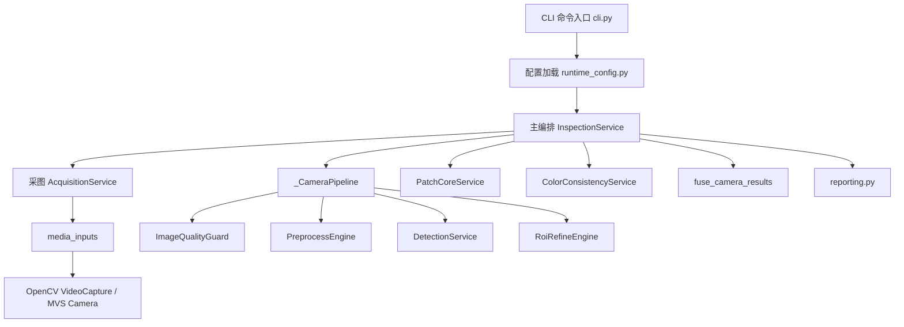

# 项目整体评估与调用链说明

本文档用于重新梳理当前 `seat_defect_inspection` 项目的整体能力、模块职责、核心类/函数、数据结构与完整调用流程。

## 1. 当前整体评估

| 评估项 | 当前状态 | 说明 |
| --- | --- | --- |
| 多机位采图流程 | 已闭环 | `capture` 命令可对所有启用机位抓图并输出 manifest |
| 检测主流程 | 已闭环 | `inspect` 命令已串起采图、OpenCV、YOLO、ROI、PatchCore、融合、报告输出 |
| OpenCV 中间层 | 已增强 | YOLO 前加入白平衡、光照校正；PatchCore 前加入 ROI 纹理增强、背景压制 |
| YOLO 调用 | 已接通 | `DetectionService` 支持权重推理，也支持 `fallback_box` 兜底 |
| ROI 精修 | 已接通 | 支持扩框、GrabCut、忽略区掩膜、对齐、前景羽化、纹理增强 |
| PatchCore 推理 | 已接通 | 支持按机位单独模型推理，并输出热力图 |
| PatchCore 训练 | 已接通 | 训练阶段复用线上 OpenCV + ROI 链路，保证训练/推理一致 |
| 颜色分支 | 已接通 | 可选启用；颜色不敏感模式下可跳过 |
| 多型号路由 | 已接通 | 通过 `seat_model_id` 选择整套机位、YOLO 配置和 PatchCore 模型 |
| 每机位独立 PatchCore | 已接通 | 模型路径由 `camera.patchcore_model_path` 单独管理 |
| 按型号 + 按机位路由 | 已接通 | 当前路由粒度为 `seat_model_id -> camera_id` |
| YOLO 训练封装 | 基本完整 | 提供 Ultralytics 训练封装，但数据治理、版本治理仍需现场完善 |
| MVS 真机现场验证 | 待现场联调 | 代码链路已接通，当前开发环境未做真机产线联调 |
| 产线级运维能力 | 需继续增强 | 暂缺模型版本管理、日志平台、健康监控、自动回归校验 |

结论：

1. 当前项目已经不是“零散脚本”，而是具备完整检测闭环的独立工程。
2. 业务主链路已经清晰，核心入口集中在 `cli.py` 和 `service.py`。
3. 当前最核心的中间层是 OpenCV，承担了“稳定输入分布、压低背景干扰、为 YOLO/PatchCore 提供一致输入”的职责。
4. 当前最大的剩余风险不在代码主链路，而在现场数据分布、真机相机参数、标注质量和模型版本治理。

## 2. 项目分层



分层说明：

| 层级 | 模块 | 作用 |
| --- | --- | --- |
| 命令入口层 | `cli.py` | 解析命令参数并调用业务入口 |
| 配置解析层 | `runtime_config.py` + `config.py` | 将 JSON 配置转换为 dataclass |
| 主编排层 | `service.py` | 串起采图、预处理、检测、训练、融合、报告 |
| 视觉处理层 | `quality.py` `preprocess.py` `detection.py` `roi.py` | 完成图像质量门控、OpenCV、YOLO、ROI 精修 |
| 异常检测层 | `patchcore.py` `color_branch.py` | 完成纹理异常与颜色异常建模和推理 |
| 融合输出层 | `fusion.py` `reporting.py` | 汇总多机位结果并写出 JSON |
| 输入适配层 | `media_inputs` `mvsCamera` | 屏蔽图片/视频/普通相机/MVS 相机差异 |

## 3. 核心配置类说明

这些类定义在 `src/seat_defect_inspection/config.py`，已经在代码内补充字段说明。

| 类名 | 作用 | 关键字段 |
| --- | --- | --- |
| `QualityGuardConfig` | 图像质量门控阈值 | 清晰度、亮度、过曝/欠曝占比 |
| `PreprocessConfig` | YOLO 前 OpenCV 配置 | 去噪、白平衡、光照校正、CLAHE、锐化、畸变校正 |
| `DetectionConfig` | YOLO 检测配置 | 权重路径、目标类别、忽略类别、fallback box |
| `AlignmentConfig` | ROI 对齐配置 | ECC 模板、输出尺寸、迭代次数 |
| `RoiRefineConfig` | ROI 精修配置 | 扩框、掩膜清理、局部增强、背景压制 |
| `PatchCoreConfig` | PatchCore 配置 | image_size、patch_size、stride、threshold、texture_input |
| `ColorBranchConfig` | 颜色分支配置 | 是否启用、阈值、最小有效像素占比 |
| `CameraConfig` | 单机位总配置 | source、train_good_dir、patchcore_model_path、各子配置 |
| `FusionConfig` | 多机位融合策略 | `reject_on_any_reject`、`ng_strategy` |
| `YoloTrainingConfig` | YOLO 训练配置 | 数据集 YAML、epochs、imgsz、batch、输出目录 |
| `SeatModelConfig` | 单型号配置集合 | `seat_model_id`、`cameras`、`yolo_training` |
| `InspectionConfig` | 项目顶层配置 | `cameras` / `seat_models`、输出目录、融合策略 |

## 4. 核心运行时数据结构说明

这些类定义在 `src/seat_defect_inspection/schemas.py`，已经在代码内补充字段说明。

| 类名 | 作用 | 关键字段 |
| --- | --- | --- |
| `BoundingBox` | 矩形框 | `x1 y1 x2 y2 width height` |
| `FramePacket` | 单机位抓图输出 | `camera_id frame_id part_id source image` |
| `ImageQualityMetrics` | 质量指标 | 清晰度、亮度、过曝/欠曝占比 |
| `ImageQualityDecision` | 质量门控结论 | `accepted reason metrics` |
| `DetectionObject` | 单个检测目标 | `label confidence bounding_box segmentation_mask` |
| `DetectionResult` | YOLO 阶段结果 | `target ignores all_objects` |
| `RoiRefineResult` | ROI 精修结果 | `aligned_roi_image texture_ready_image target_mask valid_mask` |
| `TextureAnomalyResult` | PatchCore 输出 | `score threshold heatmap valid_patch_ratio` |
| `ColorAnomalyResult` | 颜色分支输出 | `score threshold diagnostics` |
| `CameraInspectionResult` | 单机位检测结果 | `status reason quality detection texture_result color_result` |
| `InspectionResult` | 多机位融合结果 | `status decision_reason camera_results` |
| `CaptureRecord` | 单机位采图落盘记录 | `status reason output_path train_good_path` |
| `CaptureSummary` | 一次采图汇总 | `records manifest_path output_dir` |

## 5. 模块、类、函数梳理

### 5.1 CLI 入口层

文件：`src/seat_defect_inspection/cli.py`

| 符号 | 类型 | 作用 | 上游调用 | 下游调用 |
| --- | --- | --- | --- | --- |
| `build_parser` | 函数 | 注册四个子命令与参数 | `main` | `_run_*` |
| `_run_train_patchcore` | 函数 | 执行 PatchCore 训练入口 | `argparse` | `load_config` `train_patchcore_models` |
| `_run_capture` | 函数 | 执行采图入口 | `argparse` | `load_config` `capture_samples` |
| `_run_inspect` | 函数 | 执行完整检测入口 | `argparse` | `load_config` `run_inspection` |
| `_run_train_yolo` | 函数 | 执行 YOLO 训练入口 | `argparse` | `load_yolo_training_config` `train_yolo_model` |
| `main` | 函数 | 命令行主入口 | `python -m` / console script | `build_parser` |

### 5.2 配置加载层

文件：`src/seat_defect_inspection/runtime_config.py`

| 符号 | 类型 | 作用 | 上游调用 | 下游调用 |
| --- | --- | --- | --- | --- |
| `load_config` | 函数 | 加载主检测配置 | CLI | `_load_inspection_payload` `_build_dataclass` |
| `load_yolo_training_config` | 函数 | 加载 YOLO 训练配置 | CLI | `_resolve_yolo_training_payload` `_build_dataclass` |
| `_build_dataclass` | 函数 | 按 dataclass 结构递归构造配置对象 | `load_config` `load_yolo_training_config` | `_normalize_payload` `_coerce_value` |
| `_normalize_payload` | 函数 | 处理默认值、路径与 seat_model_id 注入 | `_build_dataclass` | `_resolve_*` 系列 |
| `_select_seat_model_payload` | 函数 | 选择具体型号配置块 | `load_yolo_training_config` | 无 |
| `_resolve_*` 系列 | 函数 | 路径和 source 解析 | 构造配置时 | 无 |

配置加载逻辑：

1. 读取 JSON 文件。
2. 提取 `seat_defect_inspection` 主块。
3. 若存在 `seat_models`，构建多型号配置。
4. 若存在顶层 `cameras`，构建单型号配置。
5. 把所有相对路径解析为基于配置文件目录的绝对路径。

### 5.3 采图与输入适配层

文件：`src/seat_defect_inspection/acquisition.py`

| 符号 | 类型 | 作用 | 上游调用 | 下游调用 |
| --- | --- | --- | --- | --- |
| `AcquisitionService` | 类 | 把单机位输入源抓成 `FramePacket` | `InspectionService` | `media_inputs` |
| `AcquisitionService.capture` | 方法 | 按机位采一帧 | `capture` `run_inspection` | `infer_source_kind` `load_image_frame` `open_frame_stream` |

文件：`src/media_inputs/core.py`

| 符号 | 类型 | 作用 | 上游调用 | 下游调用 |
| --- | --- | --- | --- | --- |
| `MediaSourceInfo` | dataclass | 输入源基础信息 | 输入层内部 | 无 |
| `MediaFrame` | dataclass | 标准化单帧 | 输入层内部 | 无 |
| `FrameStream` | Protocol | 标准帧流接口约束 | 业务层 | 实现类 `_CaptureFrameStream` |
| `_CaptureFrameStream` | 类 | 包装 OpenCV/MVS 流对象 | `open_frame_stream` | 底层 `read`/`release` |
| `infer_source_kind` | 函数 | 判断 source 类型 | `AcquisitionService` | `mvsCamera.is_mvs_source` |
| `open_frame_stream` | 函数 | 打开视频流/普通相机/MVS 相机 | `AcquisitionService` | `cv2.VideoCapture` / `open_mvs_capture` |
| `load_image_frame` | 函数 | 加载图片为标准帧 | `AcquisitionService` | `cv2.imread` |

文件：`src/mvsCamera/frame_source.py`

| 符号 | 类型 | 作用 | 上游调用 | 下游调用 |
| --- | --- | --- | --- | --- |
| `MvsCameraSourceConfig` | dataclass | `mvs://` 结构化配置 | `parse_mvs_source` | `to_locator` `to_property_config` |
| `parse_mvs_source` | 函数 | 解析 `mvs://` 地址 | `open_mvs_capture` | `_apply_selector_*` |
| `open_mvs_capture` | 函数 | 创建工业相机取流对象 | `media_inputs.open_frame_stream` | `MvsCameraCapture` |
| `MvsCameraCapture` | 类 | 提供 `cv2.VideoCapture` 风格接口 | `media_inputs` | `HikCamera` |

文件：`src/mvsCamera/camera_controller.py`

| 符号 | 类型 | 作用 |
| --- | --- | --- |
| `MvsDeviceInfo` | dataclass | 标准化设备信息 |
| `CameraLocator` | dataclass | 相机选择器，支持 index / SN / IP / MAC |
| `CameraPropertyConfig` | dataclass | 曝光、增益、尺寸、偏移等运行参数 |
| `HikCamera` | 类 | 海康相机打开、配置、开始取流、读取 BGR 帧的核心控制器 |

MVS 实际调用链：

1. `AcquisitionService.capture`
2. `media_inputs.open_frame_stream`
3. `mvsCamera.open_mvs_capture`
4. `MvsCameraCapture.__init__`
5. `HikCamera.open`
6. `HikCamera.start_grabbing`
7. `MvsCameraCapture.read`
8. `HikCamera.get_frame`

### 5.4 图像质量与 OpenCV 预处理层

文件：`src/seat_defect_inspection/quality.py`

| 符号 | 类型 | 作用 | 上游调用 | 下游调用 |
| --- | --- | --- | --- | --- |
| `ImageQualityGuard` | 类 | 质量门控 | `_CameraPipeline` | OpenCV 基础算子 |
| `ImageQualityGuard.evaluate` | 方法 | 计算质量指标并给出 ACCEPT / REJECT | `_CameraPipeline.prepare_image` | `cv2.Laplacian` 等 |

文件：`src/seat_defect_inspection/preprocess.py`

| 符号 | 类型 | 作用 | 上游调用 | 下游调用 |
| --- | --- | --- | --- | --- |
| `PreprocessEngine` | 类 | YOLO 前 OpenCV 预处理 | `_CameraPipeline` | `_denoise` `_white_balance` `_normalize_lighting` |
| `PreprocessEngine.process` | 方法 | 主预处理流程 | `_CameraPipeline.prepare_image` | OpenCV 组合链 |
| `_flatten_illumination_channel` | 函数 | 大核亮度场归一化 | `PreprocessEngine._normalize_lighting` | 无 |
| `_apply_unsharp_mask` | 函数 | 反卷积式锐化 | `PreprocessEngine.process` | 无 |
| `_odd_kernel` | 函数 | 保证卷积核为奇数 | 多处 | 无 |

`PreprocessEngine.process` 调用顺序：

1. 畸变校正
2. resize
3. 去噪
4. 白平衡
5. 光照归一化
6. CLAHE
7. gamma
8. 锐化

### 5.5 YOLO 检测层

文件：`src/seat_defect_inspection/detection.py`

| 符号 | 类型 | 作用 | 上游调用 | 下游调用 |
| --- | --- | --- | --- | --- |
| `DetectionService` | 类 | 执行 YOLO 检测或 fallback | `_CameraPipeline` | `ultralytics.YOLO` |
| `DetectionService.detect` | 方法 | 返回 `DetectionResult` | `_CameraPipeline.prepare_image` | `_extract_detections` |
| `_build_fallback_target` | 方法 | 构造静态目标框 | `detect` | 无 |
| `_extract_detections` | 方法 | 解析 YOLO 输出为 `DetectionObject` | `detect` | `_extract_masks` |
| `_extract_masks` | 方法 | 解析分割掩膜并 resize 到原图尺寸 | `_extract_detections` | OpenCV |

### 5.6 ROI 精修层

文件：`src/seat_defect_inspection/roi.py`

| 符号 | 类型 | 作用 | 上游调用 |
| --- | --- | --- | --- |
| `RoiRefineEngine` | 类 | 根据检测框生成标准 ROI、掩膜和 PatchCore 输入 | `_CameraPipeline` |
| `RoiRefineEngine.refine` | 方法 | ROI 主流程入口 | `_CameraPipeline.prepare_image` |
| `_expand_box` | 函数 | 对检测框扩缩边界 | `refine` |
| `_grabcut_foreground` | 函数 | 当无分割 mask 时用 GrabCut 估计前景 | `_build_target_mask` |
| `_clean_mask` | 函数 | 目标/忽略掩膜形态学清理 | `refine` |
| `_safe_texture_mask` | 函数 | 纹理分析安全边界腐蚀 | `_prepare_texture_image` |
| `_build_foreground_weight` | 函数 | 生成前景羽化权重 | `_prepare_texture_image` |
| `_apply_masked_clahe` | 函数 | 仅在前景区域做 CLAHE | `_prepare_texture_image` |
| `_apply_masked_illumination_correction` | 函数 | 仅在前景区域做光照展平 | `_prepare_texture_image` |
| `_denoise_texture_image` | 函数 | ROI 纹理图去噪 | `_prepare_texture_image` |
| `_enhance_texture_edges` | 函数 | 用 Scharr/Laplacian 增强纹理边缘 | `_prepare_texture_image` |
| `_suppress_background` | 函数 | 压低 ROI 外背景影响 | `_prepare_texture_image` |

`RoiRefineEngine.refine` 调用顺序：

1. 根据 `DetectionResult.target` 扩框裁剪 ROI
2. 生成 `target_mask`
3. 生成 `ignore_mask`
4. 根据配置执行 resize 或 ECC 对齐
5. 清理掩膜并生成 `valid_mask`
6. 构造 `texture_ready_image`
7. 返回 `RoiRefineResult`

### 5.7 PatchCore 纹理异常层

文件：`src/seat_defect_inspection/patchcore.py`

| 符号 | 类型 | 作用 | 上游调用 |
| --- | --- | --- | --- |
| `_PatchBatch` | dataclass | 记录 patch 网格和有效 patch 统计 | `extract_patch_embeddings` |
| `LoadedModelBundle` | dataclass | PatchCore 模型 + 颜色分支模型包 | `InspectionService._load_model_bundle` |
| `PatchCoreService` | 类 | PatchCore 训练/推理主类 | `InspectionService` |
| `PatchCoreService.fit` | 方法 | 训练记忆库、均值方差和阈值 | `train_patchcore_models` |
| `PatchCoreService.predict` | 方法 | 单张 ROI 推理并生成热力图 | `_inspect_one_camera` |
| `PatchCoreService.save` | 方法 | 保存模型与颜色分支 profile | `train_patchcore_models` |
| `PatchCoreService.load_bundle` | 类方法 | 从磁盘恢复模型包 | `_load_model_bundle` |
| `extract_patch_embeddings` | 函数 | 从 ROI 中提取 patch 特征 | `fit` `predict` |
| `_prepare_feature_inputs` | 函数 | 预计算灰度/LAB/梯度等特征底图 | `extract_patch_embeddings` |
| `_build_patch_feature` | 函数 | 构造单个 patch 的特征向量 | `extract_patch_embeddings` |
| `coreset_subsample` | 函数 | 记忆库多样性压缩 | `fit` |
| `min_distance_to_bank` | 函数 | 最近邻距离计算 | `score_embeddings` |
| `normalize_map` | 函数 | 热力图归一化 | `predict` |

PatchCore 训练逻辑：

1. 对每张正常 ROI 提取 patch embedding。
2. 统计全体 embedding 的均值和方差。
3. 对 embedding 做标准化。
4. 使用 `coreset_subsample` 选出代表性正常 patch。
5. 用训练样本分数统计阈值。

PatchCore 推理逻辑：

1. 提取当前 ROI 的 patch embedding。
2. 与记忆库做最近邻距离计算。
3. 取高分位数作为该图的异常分数。
4. 把 patch 分数还原为热力图。

### 5.8 颜色一致性分支

文件：`src/seat_defect_inspection/color_branch.py`

| 符号 | 类型 | 作用 | 上游调用 |
| --- | --- | --- | --- |
| `ColorReferenceProfile` | dataclass | 颜色正常分布模型 | `PatchCoreService.save/load_bundle` |
| `ColorConsistencyService` | 类 | 颜色分支训练和推理 | `InspectionService` |
| `ColorConsistencyService.fit` | 方法 | 训练颜色均值、方差、阈值 | `train_patchcore_models` |
| `ColorConsistencyService.predict` | 方法 | 给 ROI 做颜色一致性判断 | `_inspect_one_camera` |
| `_extract_color_feature` | 函数 | 提取 LAB 均值与标准差 | `fit` `predict` |
| `_valid_pixel_ratio` | 函数 | 检查有效像素覆盖率 | `fit` `predict` |

### 5.9 多机位融合与报告层

文件：`src/seat_defect_inspection/fusion.py`

| 符号 | 类型 | 作用 | 上游调用 |
| --- | --- | --- | --- |
| `fuse_camera_results` | 函数 | 融合单机位结果为最终结果 | `InspectionService.run_inspection` |
| `_apply_ng_strategy` | 函数 | 判断 NG 的融合策略 | `fuse_camera_results` |

文件：`src/seat_defect_inspection/reporting.py`

| 符号 | 类型 | 作用 | 上游调用 |
| --- | --- | --- | --- |
| `export_inspection_report` | 函数 | 输出最终检测结果 JSON | `run_inspection` |
| `export_capture_manifest` | 函数 | 输出采图 manifest | `capture` |
| `_camera_result_to_dict` | 函数 | 序列化单机位结果 | 输出层内部 |
| `_capture_record_to_dict` | 函数 | 序列化单机位采图记录 | 输出层内部 |
| `_box_to_dict` | 函数 | 序列化框坐标 | 输出层内部 |

### 5.10 主编排层

文件：`src/seat_defect_inspection/service.py`

| 符号 | 类型 | 作用 | 上游调用 |
| --- | --- | --- | --- |
| `PreparedCameraSample` | dataclass | 单机位中间结果容器 | `_CameraPipeline.prepare_image` |
| `_ResolvedInspectionContext` | dataclass | 当前型号上下文 | `InspectionService` 内部 |
| `_CameraPipeline` | 类 | 单机位图像准备流程 | `InspectionService` |
| `InspectionService` | 类 | 全项目总编排服务 | CLI 入口函数 |
| `InspectionService.train_patchcore_models` | 方法 | 按机位训练 PatchCore | `train_patchcore_models` |
| `InspectionService.capture` | 方法 | 多机位采图 | `capture_samples` |
| `InspectionService.run_inspection` | 方法 | 多机位完整检测 | `run_inspection` |
| `InspectionService._inspect_one_camera` | 方法 | 单机位完整检测 | `run_inspection` |
| `InspectionService._resolve_context` | 方法 | 解析型号路由与机位缓存 | 多个主流程 |
| `InspectionService._resolve_active_cameras` | 方法 | 决定当前真正启用的机位 | `_resolve_context` |
| `InspectionService._build_patchcore_service` | 方法 | 创建 PatchCore 服务 | 训练阶段 |
| `InspectionService._load_model_bundle` | 方法 | 加载模型包 | 推理阶段 |
| `InspectionService._save_artifacts` | 方法 | 保存调试图 | 训练/推理阶段 |
| `train_patchcore_models` | 函数 | 顶层便捷入口 | CLI |
| `capture_samples` | 函数 | 顶层便捷入口 | CLI |
| `run_inspection` | 函数 | 顶层便捷入口 | CLI |

`_CameraPipeline.prepare_image` 是单机位图像准备的核心入口：

1. `ImageQualityGuard.evaluate`
2. `PreprocessEngine.process`
3. `DetectionService.detect`
4. `RoiRefineEngine.refine`

`InspectionService._inspect_one_camera` 是单机位完整检测的核心入口：

1. `_CameraPipeline.prepare_image`
2. `_load_model_bundle`
3. `PatchCoreService.predict`
4. 可选 `ColorConsistencyService.predict`
5. `_save_artifacts`
6. 生成 `CameraInspectionResult`

## 6. 四条主流程的完整调用详情

### 6.1 `capture` 采图流程

命令入口：

```text
cli.main
  -> build_parser
  -> _run_capture
  -> runtime_config.load_config
  -> service.capture_samples
  -> InspectionService.capture
```

内部调用顺序：

1. `InspectionService.capture` 调用 `_resolve_context`，确定当前型号和启用机位。
2. 遍历每个机位，调用 `AcquisitionService.capture(camera_id, source, part_id)`。
3. `AcquisitionService.capture` 根据 `source_kind` 走两条分支：
   - 图片：`load_image_frame`
   - 流式输入：`open_frame_stream -> read_frame`
4. 若 `source` 是 `mvs://`，则进一步走：
   - `media_inputs.open_frame_stream`
   - `mvsCamera.open_mvs_capture`
   - `MvsCameraCapture.read`
5. 拿到 `FramePacket` 后，`InspectionService._save_captured_frame` 落盘。
6. 如果启用 `save_to_train_good_dir`，调用 `_save_train_good_frame`。
7. 全部机位完成后，调用 `export_capture_manifest` 输出 `manifest.json`。

### 6.2 `inspect` 完整检测流程

命令入口：

```text
cli.main
  -> build_parser
  -> _run_inspect
  -> runtime_config.load_config
  -> service.run_inspection
  -> InspectionService.run_inspection
```

内部调用顺序：

1. `InspectionService.run_inspection` 调用 `_resolve_context`。
2. 对每个机位先调用 `AcquisitionService.capture` 抓图。
3. 抓到图后调用 `_inspect_one_camera(frame_packet, camera, pipeline, seat_model_id)`。
4. `_inspect_one_camera` 先调用 `_CameraPipeline.prepare_image`。
5. `_CameraPipeline.prepare_image` 依次调用：
   - `ImageQualityGuard.evaluate`
   - `PreprocessEngine.process`
   - `DetectionService.detect`
   - `RoiRefineEngine.refine`
6. 若某一步失败，直接返回 `REJECT` 类结果。
7. 若准备成功，调用 `_load_model_bundle` 加载该机位模型。
8. 调用 `PatchCoreService.predict(texture_input, valid_mask, zeros_ignore_mask)`。
9. 若启用了颜色分支且未开启颜色不敏感模式，再调用：
   - `ColorConsistencyService.predict(aligned_roi_image, valid_mask)`
10. 根据纹理分支与颜色分支结果生成单机位 `OK / NG / REJECT`。
11. 调用 `_save_artifacts` 按 `debug_artifact_mode` 保存调试图。
    默认 `standard` 输出 `raw.png detections.png roi.png patchcore_input.png overlay.png`；
    `full` 会额外输出 `preprocessed.png roi_texture.png foreground_weight.png target_mask.png ignore_mask.png valid_mask.png heatmap.png`。
12. 所有机位处理完成后，调用 `fuse_camera_results`。
13. 最终结果通过 `export_inspection_report` 输出；固定路径保留最新结果，历史结果按型号/工件/帧号归档。

### 6.3 `train-patchcore` 训练流程

命令入口：

```text
cli.main
  -> build_parser
  -> _run_train_patchcore
  -> runtime_config.load_config
  -> service.train_patchcore_models
  -> InspectionService.train_patchcore_models
```

内部调用顺序：

1. `InspectionService.train_patchcore_models` 调用 `_resolve_training_scope` 决定训练哪些型号。
2. 对每个型号调用 `_resolve_context`，获得当前启用机位和 `_CameraPipeline`。
3. 每个机位读取 `train_good_dir` 下全部图片：`patchcore.list_images`。
4. 对每张正常样本图执行：
   - `cv2.imread`
   - `_CameraPipeline.prepare_image`
5. 训练阶段复用线上完整链路，因此也会经过：
   - 质量门控
   - OpenCV 预处理
   - YOLO/静态框
   - ROI 精修
6. 成功样本生成两组数据：
   - `patchcore_samples = (texture_image, valid_mask, zeros_ignore_mask)`
   - `color_samples = (aligned_roi_image, valid_mask)`
7. 调用 `_build_patchcore_service` 创建 `PatchCoreService`。
8. 调用 `PatchCoreService.fit` 训练纹理模型。
9. 若颜色分支开启且未启用颜色不敏感模式，调用 `ColorConsistencyService.fit`。
10. 调用 `PatchCoreService.save`，把纹理模型和颜色 profile 一起保存。
11. 每个机位生成 `.summary.json` 训练摘要。

### 6.4 `train-yolo` 训练流程

命令入口：

```text
cli.main
  -> build_parser
  -> _run_train_yolo
  -> runtime_config.load_yolo_training_config
  -> yolo_training.train_yolo_model
```

内部调用顺序：

1. `load_yolo_training_config` 根据 `seat_model_id` 选择对应训练块。
2. `train_yolo_model` 校验数据集 YAML 路径。
3. 通过 `ultralytics.YOLO(config.model_path)` 创建模型。
4. 调用 `model.train(...)` 启动训练。
5. 训练结束后生成摘要：
   - `best.pt`
   - `last.pt`
   - `training_summary.json`

## 7. 当前项目中最关键的几个“总入口”

如果只想快速读懂项目，优先看下面这些符号：

| 优先级 | 文件 | 符号 | 原因 |
| --- | --- | --- | --- |
| 1 | `service.py` | `InspectionService` | 项目总编排都在这里 |
| 2 | `service.py` | `_CameraPipeline.prepare_image` | 单机位图像准备主链路 |
| 3 | `cli.py` | `main` 和 `_run_*` | 所有命令入口都从这里进 |
| 4 | `runtime_config.py` | `load_config` | 配置如何映射到运行时对象都在这里 |
| 5 | `roi.py` | `RoiRefineEngine.refine` | ROI 和 PatchCore 输入如何构造都在这里 |
| 6 | `patchcore.py` | `PatchCoreService.fit/predict` | 异常检测的核心算法入口 |
| 7 | `detection.py` | `DetectionService.detect` | YOLO 与 fallback 的分叉都在这里 |

## 8. 当前代码中的关键缓存与隐式状态

| 位置 | 变量 | 作用 |
| --- | --- | --- |
| `InspectionService` | `_pipeline_cache` | 缓存每个型号下的 `_CameraPipeline` |
| `InspectionService` | `_model_cache` | 缓存 `(seat_model_id, camera_id)` 对应的模型包 |
| `DetectionService` | `_model` | 延迟加载 YOLO 模型，避免重复初始化 |
| `HikCamera` | `sdk_initialized` `instance_count` | 控制海康 SDK 的初始化与释放 |

这些状态说明：

1. 当前项目默认是“单进程复用服务实例”的写法。
2. 如果未来要改成多进程或服务化部署，需要重新考虑缓存、并发与资源释放。

## 9. 代码阅读建议

建议按下面顺序阅读代码：

1. `cli.py`
2. `runtime_config.py`
3. `service.py`
4. `acquisition.py`
5. `quality.py`
6. `preprocess.py`
7. `detection.py`
8. `roi.py`
9. `patchcore.py`
10. `color_branch.py`
11. `fusion.py`
12. `reporting.py`
13. `media_inputs/core.py`
14. `mvsCamera/frame_source.py`
15. `mvsCamera/camera_controller.py`

## 10. 按产线调试顺序的阅读路径

如果目标不是“学架构”，而是“现场快速定位问题”，建议按下面顺序读。

### 10.1 第一步：先确认命令入口和配置是否跑对

阅读顺序：

1. `src/seat_defect_inspection/cli.py`
2. `src/seat_defect_inspection/runtime_config.py`
3. `configs/seat_defect_inspection.mvs.json`
4. `configs/seat_defect_inspection.multimodel.example.json`

适用问题：

- 命令参数有没有生效
- 当前到底走的是哪个 `seat_model_id`
- 当前机位是不是启用了
- 当前机位到底加载了哪个 YOLO 权重和哪个 PatchCore 模型

### 10.2 第二步：采图失败时，先读输入链路

阅读顺序：

1. `src/seat_defect_inspection/acquisition.py`
2. `src/media_inputs/core.py`
3. `src/mvsCamera/frame_source.py`
4. `src/mvsCamera/camera_controller.py`

适用问题：

- `capture` 命令失败
- MVS 相机打不开
- 现场换机后选错设备
- 取流超时
- 能打开但读不到帧

推荐定位顺序：

1. 先看 `AcquisitionService.capture`
2. 再看 `media_inputs.infer_source_kind/open_frame_stream`
3. 再看 `parse_mvs_source`
4. 最后看 `HikCamera.open/start_grabbing/get_frame`

### 10.3 第三步：图像有了，但 YOLO 检不准时

阅读顺序：

1. `src/seat_defect_inspection/quality.py`
2. `src/seat_defect_inspection/preprocess.py`
3. `src/seat_defect_inspection/detection.py`

适用问题：

- 图像太暗、太亮、太糊
- OpenCV 处理后 YOLO 效果变差
- YOLO 检不到 `seat_main`
- 分割 mask 和框不稳定

推荐先看：

1. `ImageQualityGuard.evaluate`
2. `PreprocessEngine.process`
3. `DetectionService.detect`

### 10.4 第四步：YOLO 检到了，但 PatchCore 不稳定时

阅读顺序：

1. `src/seat_defect_inspection/roi.py`
2. `src/seat_defect_inspection/patchcore.py`
3. `src/seat_defect_inspection/color_branch.py`

适用问题：

- ROI 裁偏
- ROI 外背景干扰过强
- 同机位热力图漂移
- 颜色变化导致误报
- `valid_patch_ratio` 过低

推荐先看：

1. `RoiRefineEngine.refine`
2. `_prepare_texture_image`
3. `PatchCoreService.predict`
4. `ColorConsistencyService.predict`

### 10.5 第五步：单机位正常，但整机结果异常时

阅读顺序：

1. `src/seat_defect_inspection/service.py`
2. `src/seat_defect_inspection/fusion.py`
3. `src/seat_defect_inspection/reporting.py`

适用问题：

- 明明单机位都 OK，最终结果却 REJECT
- 某一路失败导致整体被打回
- 最终 JSON 和调试图不一致

推荐先看：

1. `InspectionService._inspect_one_camera`
2. `fuse_camera_results`
3. `export_inspection_report`

### 10.6 第六步：训练结果和线上结果不一致时

阅读顺序：

1. `src/seat_defect_inspection/service.py`
2. `src/seat_defect_inspection/patchcore.py`
3. `src/seat_defect_inspection/yolo_training.py`

适用问题：

- PatchCore 训练好但线上误报高
- 训练集和线上 ROI 分布不一致
- YOLO 新模型上线后 ROI 效果变了

关键原则：

1. 先确认训练阶段是否复用了 `_CameraPipeline.prepare_image`
2. 再确认 `texture_ready_image` 和 `valid_mask` 是否发生变化
3. 最后确认模型路径和 `seat_model_id` 是否选对

补充建议：

1. 排查 ROI 或 PatchCore 漂移时，先把 `debug_artifact_mode` 切到 `full`
2. 优先查看 `roi.png`、`roi_texture.png`、`patchcore_input.png`、`valid_mask.png`、`heatmap.png`、`overlay.png`
3. 只要 ROI 掩膜、`valid_mask` 生成逻辑或纹理增强链路发生变化，就必须重训对应机位的 PatchCore 模型

## 11. 重新评估后的结论

从工程视角看，当前项目已经具备下面几个优点：

1. 命令入口统一，业务主链路集中。
2. 配置与运行对象分离，便于多型号扩展。
3. OpenCV 已经成为真正的中间层，而不是简单做个 blur/resize。
4. PatchCore 训练与推理共用同一条 ROI 链路，这一点对工业项目非常关键。
5. 多型号与多机位是解耦的，后续继续扩型号时可控。

当前仍建议继续加强的点：

1. 增加模型版本号、配置版本号、训练数据版本号。
2. 增加更明确的日志分层和异常追踪。
3. 增加真机联调记录，包括曝光、增益、触发模式和光源参数。
4. 增加产线回归样本集，覆盖不同颜色、不同批次、不同光照波动。
5. 增加单元测试和离线回放测试，防止改动后链路退化。
